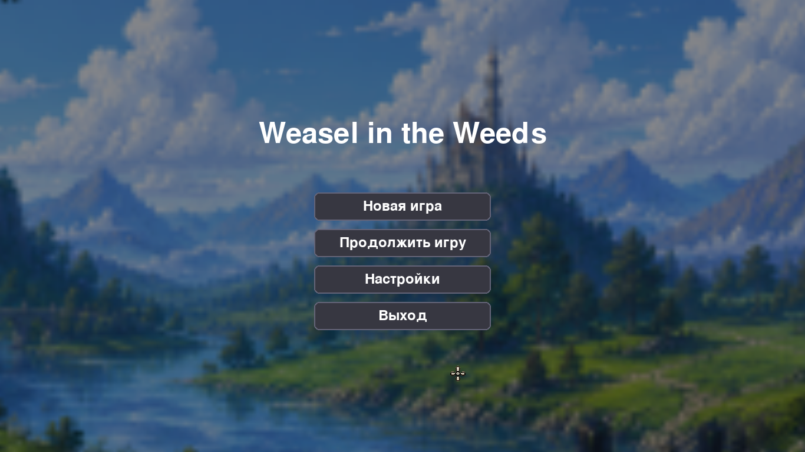
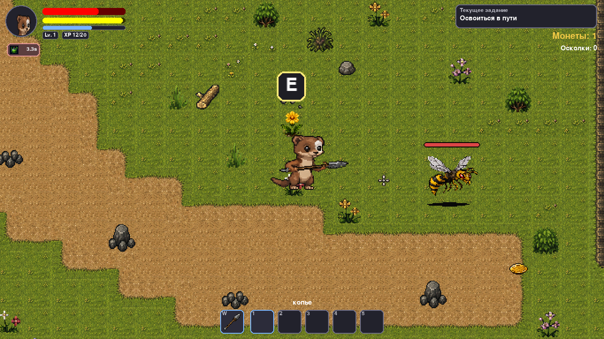
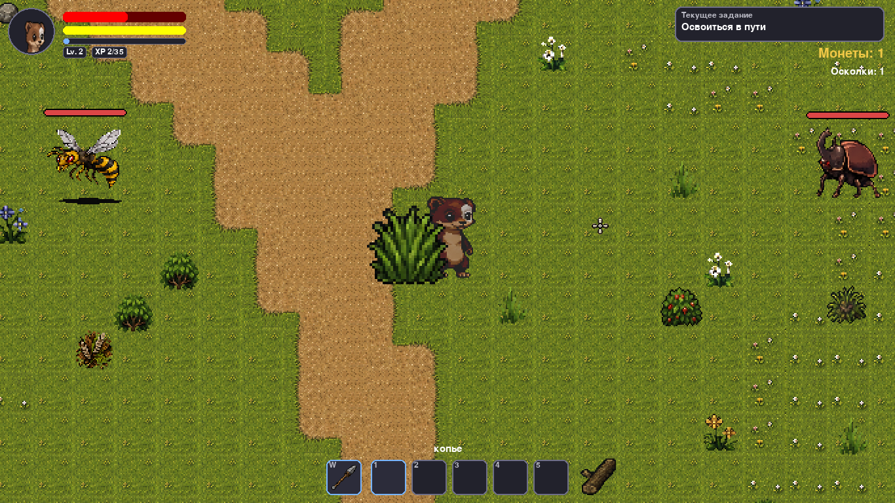
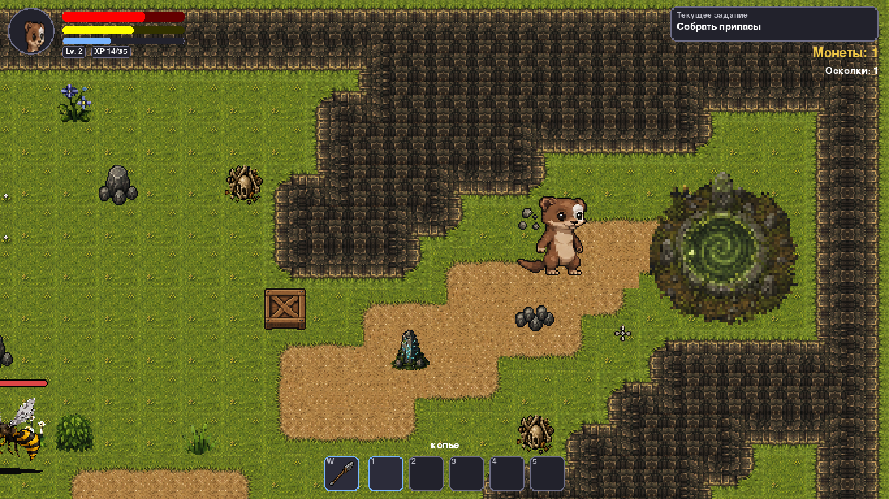
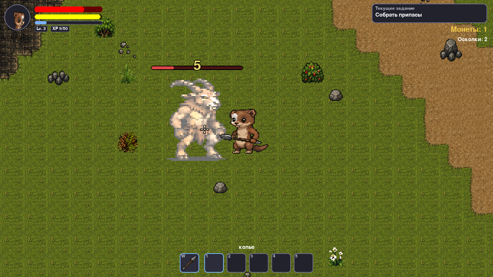
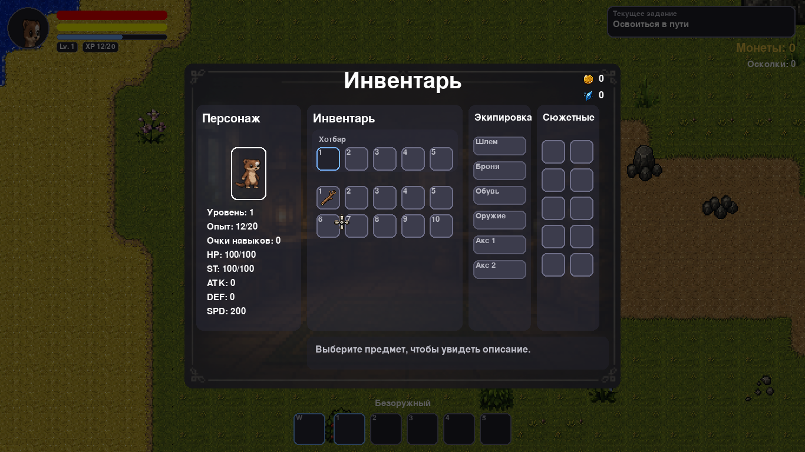
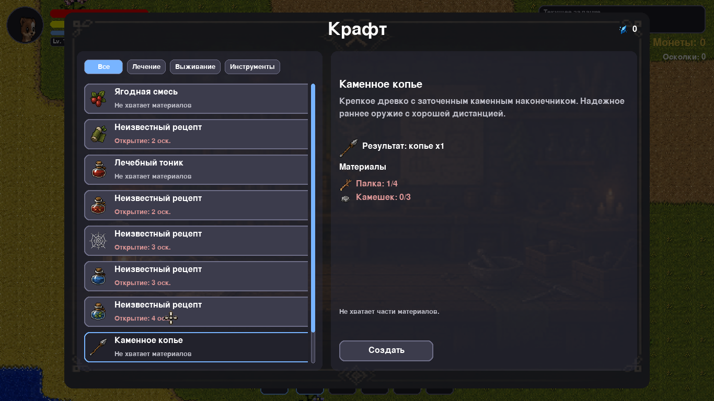
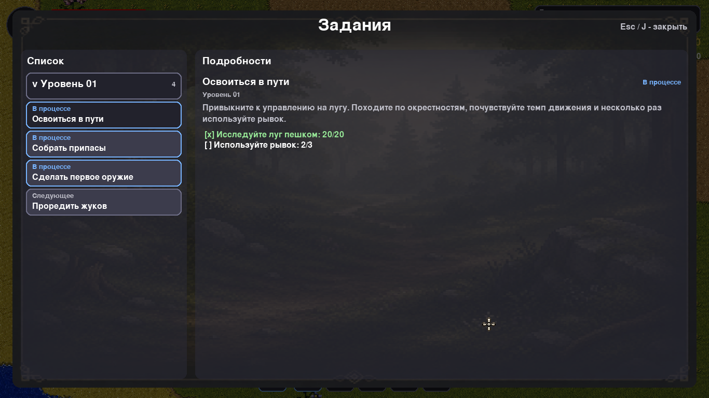
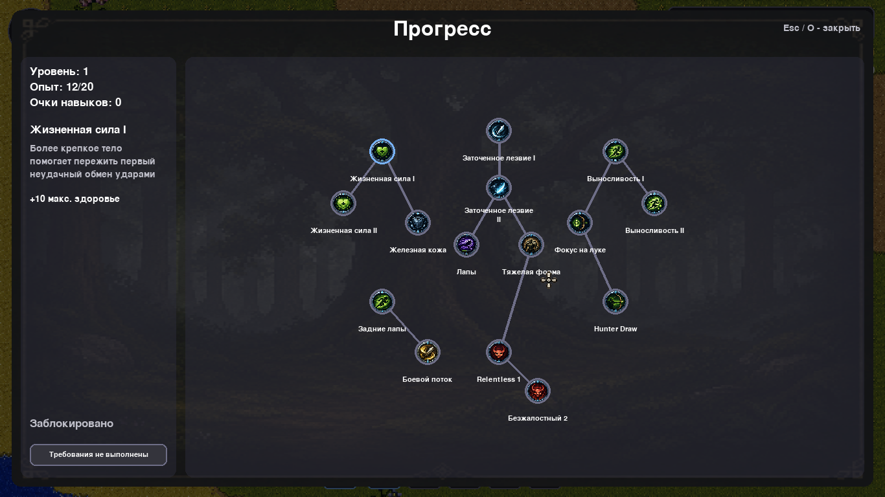
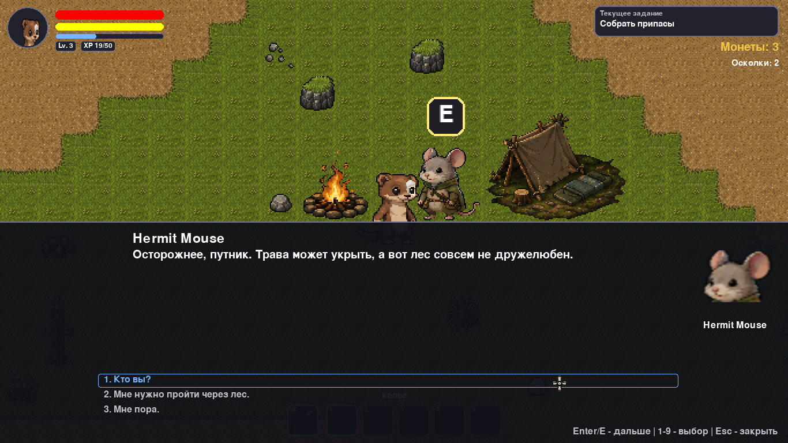

# Weasel in the Weeds

`Weasel in the Weeds` - это 2D action-adventure RPG про ласку, которую ураган оторвал от семьи. Герой приходит в себя у реки и начинает путь через луг, опушку и дремучий лес, чтобы найти своих близких.

Проект сделан как вертикальный срез игры: с несколькими уровнями, квестами, диалогами, крафтом, прогрессией, боссом, финальным чекпоинтом и сценой титров.

## Ключевые особенности

- три игровых уровня с разным наполнением;
- квесты, разбитые по уровням;
- диалоги NPC и сюжетные сцены через JSON;
- система триггеров для событий, сцен и реплик;
- крафт предметов и открытие рецептов через осколки знаний;
- дерево прогрессии героя;
- бой с боссом Forest Guardian;
- сохранения, чекпоинты, титры и Windows `.exe` сборка.

## Скриншоты

### Главное меню



### Игровой процесс






### Системы игры







## Технологии и пайплайн

- Python
- Pygame
- Tiled для сборки карт
- Aseprite для спрайтов и пиксель-арта
- PyInstaller для упаковки `.exe`

## Структура проекта

- `main.py` - точка входа.
- `game/` - основной игровой код.
- `assets/` - графика, звук, UI и музыка.
- `dialogues/` - JSON-диалоги.
- `levels/` - уровни, карты, квесты, объекты и триггеры.
- `dev_tools/` - редакторы данных проекта.
- `docs/screenshots/` - скриншоты для документации.
- `build/windows/` - конфигурация сборки Windows `.exe`.
- `release/` - локальные собранные билды. В репозиторий их можно не включать, а передавать отдельно.

## Запуск из исходников

1. Создать и активировать виртуальное окружение.

```powershell
python -m venv .venv
.\.venv\Scripts\activate
```

2. Установить зависимости.

```powershell
pip install -r requirements.txt
```

3. Запустить игру.

```powershell
python main.py
```

## Запуск готовой Windows-сборки

Если проект уже собран, запускайте файл:

```text
release/windows/WeaselInTheWeeds/WeaselInTheWeeds.exe
```

Важно: на другой компьютер нужно переносить всю папку `WeaselInTheWeeds` целиком вместе с `_internal`.

Готовый билд можно хранить вне репозитория и распространять отдельной ссылкой. Данные проекта доступны по ссылке: https://disk.yandex.ru/d/hYMHakaVmbNnsg

## Сборка `.exe`

Из корня проекта:

```powershell
powershell -ExecutionPolicy Bypass -File .\build\windows\build_exe.ps1
```

## Управление

- `WASD` - движение
- `Shift` - бег
- `Space` - прыжок
- `Q` - рывок
- `ЛКМ` - атака
- `ПКМ` - сильная атака
- `ЛКМ + ПКМ` - заряженная атака
- `E` - взаимодействие
- `Esc` - пауза / назад
- `I` - инвентарь
- `K` - крафт
- `M` - карта
- `J` - Задания
- `O` - Прокачка навыков


## Контент и инструменты

В проекте есть отдельные редакторы для:

- диалогов;
- квестов;
- предметов и рецептов;
- объектов на карте.

Это позволяет обновлять контент без ручной правки крупных JSON-файлов.

## Идея проекта

Игра разработана в рамках хакатона Kodik LaunchPad. Проект стал возможностью довести до рабочей формы идею, которую давно хотелось превратить в полноценную игру: небольшое сюжетное приключение с исследованием, атмосферой и понятным progression loop.

## Направления развития

- расширить сюжет после победы над первым боссом;
- добавить новые ветки прогрессии и крафта;
- нарастить количество NPC и уникальных событий;
- усилить onboarding и первые подсказки для игрока;
- подготовить отдельный публичный билд и страницу проекта.

## Лицензия

Код проекта распространяется по лицензии `MIT`. Полный текст находится в файле [LICENSE](C:/Users/user/Desktop/vs_code_projects/weasel_in_the_weeds/LICENSE).
